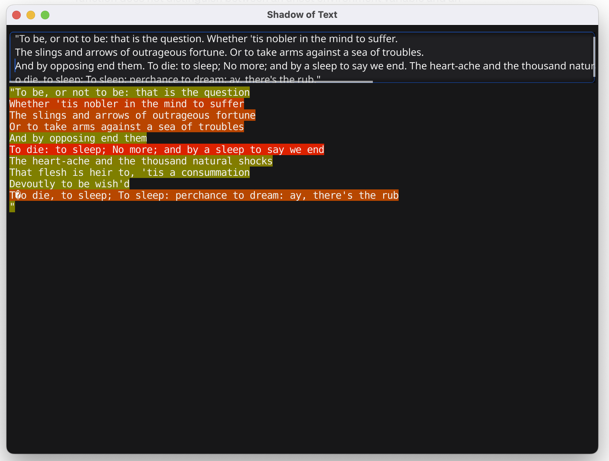

# README for Shades of Text

## Overview
Shades of Text is an innovative application that visually represents the emotional
tone of sentences using colors. It utilizes the VADER (Valence Aware Dictionary
and sEntiment Reasoner) sentiment analysis tool to score sentences, converting
these scores into corresponding color shades.



## Features
- **Text Input Analysis**: Users can input text, which is then processed to
evaluate the sentiment of each sentence.
- **Color Representation**: The sentiment score of each sentence is represented
through a specific color shade, providing an intuitive visual representation
of the text's emotional tone.
- **Dynamic Styling**: Each sentence in the input text is styled rune by rune,
creating a dynamic and engaging user experience.
- **Log Output**: The application logs the sentiment scores and corresponding
sentences for user reference and debugging.

## Installation
1. Clone the repository:
   ```
   git clone [repository URL]
   ```
2. Navigate to the project directory:
   ```
   cd shades-of-text
   ```
3. Install necessary dependencies (ensure you have Go installed):
   ```
   go get .
   ```

## Usage
1. Start the application:
   ```
   go run main.go
   ```
2. Enter text in the provided input box.
3. View the color-coded representation of the text's sentiment.

## Dependencies
- Fyne: A user interface toolkit for Go.
- Python 3: For running the sentiment analysis script.
- VADER Sentiment Analysis: Python script for sentiment analysis.

## Contributing
Contributions to Shades of Text are welcome. Please fork the repository, make
your changes, and submit a pull request.

## License
Shades of Text is released under the [MIT License](LICENSE).

## Acknowledgments
Special thanks to the developers and contributors of the VADER sentiment analysis
tool and the Fyne toolkit.
